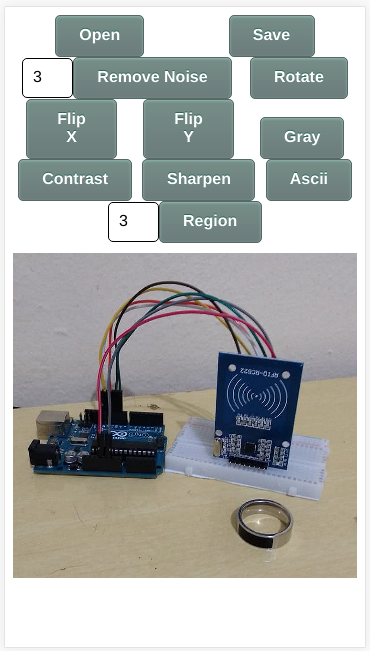

# photoEditor

A image editor made using JavaScript canvas.

An online version is hosted [here](https://victorribeiro.com/photoEditor)

# About

This is a ongoing project that started after I decided to implement some image processing algorithms I've learned along the way.

It's not fully optimized and needs some improvment, but as I said, it's a ongoing project.

# To Do

- Undo button
- Better GUI - A toolbar 
- ??? (sugestions)
